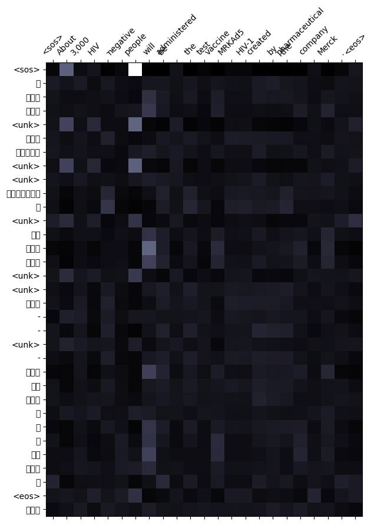
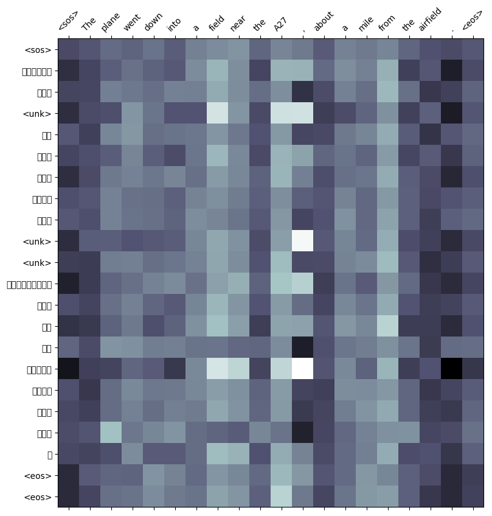
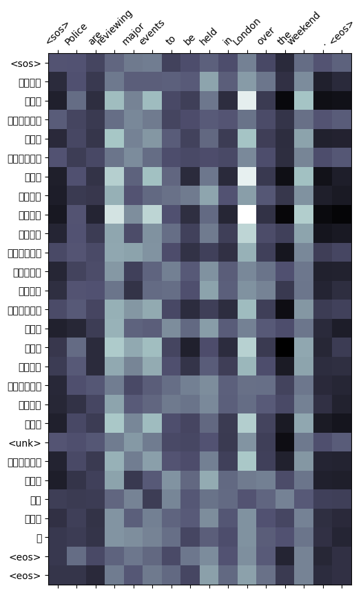
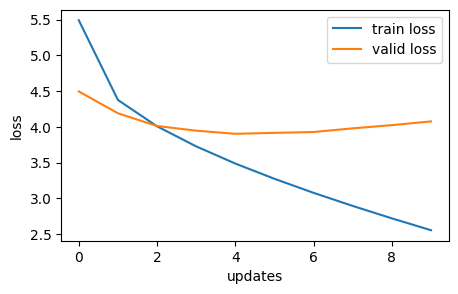
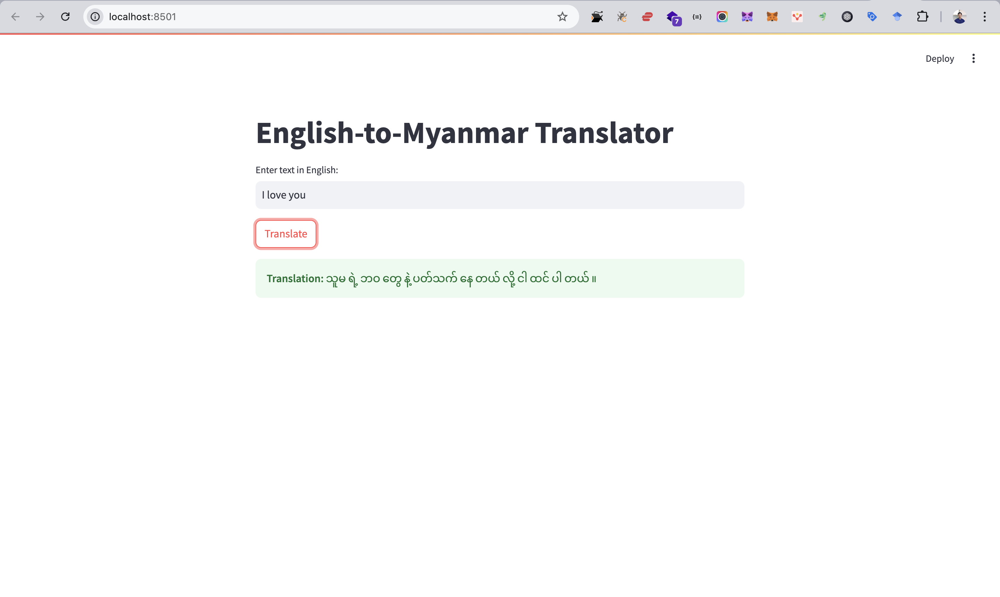

# NLP-A3-Translation-Language-st125553
## Assignment Assignment 3: Make Your Own Machine Translation Language
#### AT82.05 Artificial Intelligence: Natural Language Understanding (NLU)

## GitHubLink:
- https://github.com/Nyeinchanaung/NLP-A3-Translation-Language-st125553 

## Content
- [Student Information](#student-information)
- [Files Structure](#files-structure)
- [How to run](#how-to-run)
- [Dataset](#dataset)
- [Model Training](#training)
- [Web Application](#application)

## Student Information
 - Name     : Nyein Chan Aung
 - ID       : st125553
 - Program  : DSAI

## Files Structure
1) The Jupytor notebook files
- A3_1_En_My_Translator_Gen.ipynb
- A3_2_En_My_Translator_Multiplicative.ipynb
- A3_3_En_My_Translator_Additive.ipynb
2) `app` folder  
- app.py (streamlit)
- `models` folder which contains four model exports and their metadata files.
 
## How to run
 - Clone the repo
 - Open the project
 - Open the `app` folder
 - `streamlit run app.py`
 - app should be up and run on `http://localhost:8501/`

## Dataset
### Source
This dataset leverages a large collection of freely available parallel Myanmar-English text from OPUS (Open Parallel Corpus).  
This dataset is well-suited for training and evaluating neural machine translation (NMT) models for translating between English and Myanmar. It can also be valuable for tasks involving parallel text analysis, such as building bilingual dictionaries or studying language similarities.
- Credit To: **OPUS** : https://opus.nlpl.eu/ALT/en&my/v2019/ALT
- Hugging Face Link: https://huggingface.co/datasets/nyeinchanaung/alt-en-my

### Data Split
The dataset is thoughtfully divided for training, testing, and validation purposes:
- Training Set: 13,023 sentence pairs (English-Myanmar)
- Testing Set: 3,618 sentence pairs (English-Myanmar)
- Validation Set: 1,447 sentence pairs (English-Myanmar)
- Size: The total dataset comprises 18,088 parallel sentences, offering a substantial amount of data for training and evaluating machine translation models between English and Myanmar.

## Training
### Preprocessing

- **Data Cleaning:** The dataset underwent a cleaning process, which likely involved removing null values or empty entries to ensure data quality and prevent issues during model training.

- **Data Formatting:** The dataset was reformatted to a suitable structure for further processing and compatibility with downstream tasks. This might involve adjustments to file formats, column names, or data organization.

- **Hugging Face Upload:** The cleaned and formatted dataset was uploaded to the Hugging Face Hub. This allows for easy sharing, versioning, and reproducibility of work, as well as convenient access for others.

- **Data Loading and Splitting:**  The dataset was loaded from the Hugging Face Hub using the datasets library.
The dataset was then split into three subsets:
1) `Training set`: Used to train the machine translation model.
2) `Validation set`: Used to tune hyperparameters and monitor model performance during training.
3) `Test set`: Used to evaluate the final model's performance on unseen data.

This preprocessing pipeline ensures that the dataset is in a suitable format for machine translation model training and evaluation.

### Libraries and Tools
- **PyTorch Datasets Library:** This library provides a powerful and user-friendly interface for loading, managing, and manipulating various types of datasets.  It used to download the preprocessed dataset uploaded to Hugging Face and split it into training, validation, and testing sets for machine translation model.

- **PyIDaungsu** (https://pypi.org/project/pyidaungsu/): This library specializes in Natural Language Processing (NLP) tasks for the Myanmar language. It likely played a crucial role in tokenizing Myanmar text data. Tokenization breaks down sentences into smaller units (tokens) like words or characters, which is a fundamental step in many NLP tasks. PyIDaungsu likely offers functionalities tailored to handle the specific characteristics of Myanmar text segmentation.
#### Example
**word level tokenization**
pds.tokenize("ဖေဖေနဲ့မေမေ၏ကျေးဇူးတရားမှာကြီးမားလှပေသည်", form="word")
>> ['ဖေဖေ', 'နဲ့', 'မေမေ', '၏', 'ကျေးဇူးတရား', 'မှာ', 'ကြီးမား', 'လှ', 'ပေ', 'သည်']
## Evaluation and Verification

### Result
| Attentions                | Training Loss | Traning PPL |  Validation Loss | Validation PPL   |
|---------------------------|---------------|-------------|------------------|------------------|
| General Attention         | 2.451         | 11.603      | 3.992            | 54.171           |
| Multiplicative Attention  | 2.556         | 12.881      | 4.078            | 59.023           |
| Additive Attention        | 2.551         | 12.817      | 4.092            | 59.848           |

#### Training Loss:
- General Attention exhibits the lowest training loss (2.451), indicating better model fit on the training data.
- Additive Attention and Multiplicative Attention variations have slightly higher training losses (around 2.55).

#### Validation Loss:
- Additive Attention also demonstrates the lowest validation loss (4.010), suggesting better generalization to unseen data.
- General Attention and Multiplicative Attention models have slightly higher validation losses (around 4.078-4.092).

#### Perplexity (PPL):
- PPL provides an alternative measure of model performance. (Lower PPL indicates better model performance)
- General Attention achieves the lowest PPL on the validation set (54.171  ), further supporting its better generalization.

#### Key Observations:
Based on the validation results, General Attention appears to be the most promising model among the three tested. It exhibits lower training and validation losses and the lowest PPL on the validation set, suggesting better model performance and generalization capabilities.
- However, while quantitative metrics like Validation Loss and PPL suggested General Attention as the top performer, human evaluation revealed that Additive Attention consistently produced more relevant and human-readable translations.
- This highlights the importance of incorporating human judgment in model selection. While quantitative metrics provide valuable insights, they may not always fully capture the nuances of human language and the subjective quality of translations.
- Based on these findings, the model utilizing Additive Attention was chosen for implementation in the web application, the model prioritises user experience and the quality of translated output as perceived by human users.
- 
### Performance
#### Performance Plot
- General Attention Plot

- Multiplicative Attention Plot

- Additive Attention Plot

#### Attention Map
- General Attention Map

- Multiplicative Attention Map

- Additive Attention Map

## Application
### Application Development
The web application is built using `Streamlit`, a Python framework for creating interactive web apps. It provides a user-friendly interface for generating text using a pre-trained LSTM-based language model. Users can input a text prompt, adjust generation parameters, and view the generated text in real-time.
### How to use web app
The application likely provides a user interface where users can:
1) Input English text.
2) Trigger the translation process using the selected model (Additive Attention in this case).
3) Receive the translated Myanmar text as output.
### Screenshot

